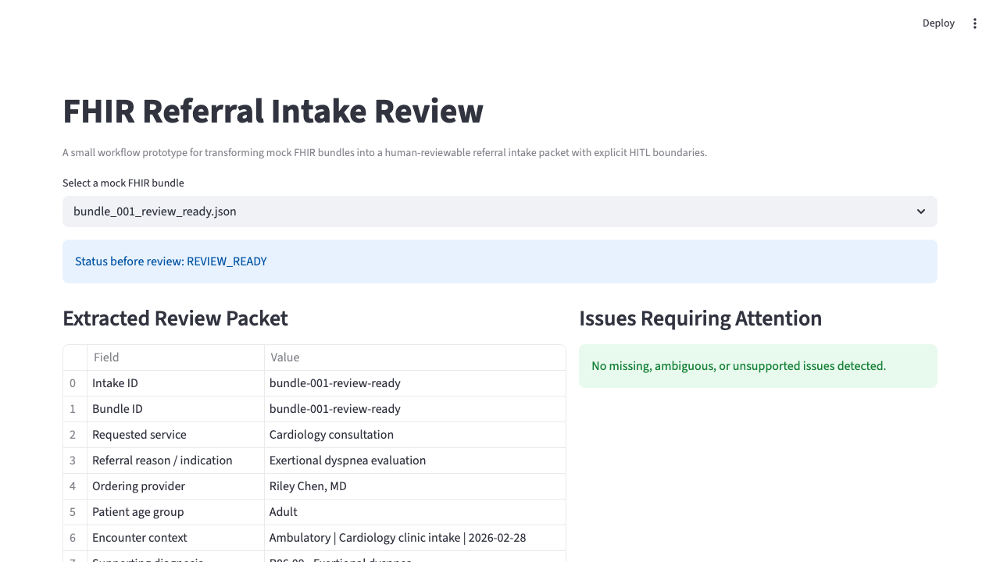

# FHIR Referral Intake Review

A referral intake coordinator often has to turn structured data, cover sheets, notes, and partial order details into a practical handoff for scheduling, authorization, or specialty routing. This prototype simulates that administrative review step using mock FHIR bundles: it extracts the referral facts that matter, explains missing or ambiguous intake issues, preserves source traceability, and requires a human reviewer before the handoff is finalized.

## Why this matters

FHIR can move referral data between systems, but it does not automatically tell an operations team whether the packet is ready for downstream work. A scheduler may need a clear specialty, an authorization team may need a supporting diagnosis, and a referral coordinator may need to confirm the ordering provider before routing the case. This project demonstrates a narrow, inspectable workflow for turning structured referral data into a human-reviewable administrative packet instead of treating interoperability as the finish line.

## What this project demonstrates

- Deterministic parsing of a small subset of FHIR resources
- Mapping mock bundle data into a clean referral intake review packet
- Explicit detection of missing, ambiguous, and unsupported elements
- Bounded status classification: `REVIEW_READY`, `INCOMPLETE`, `HUMAN_CONFIRMATION_REQUIRED`
- Source traceability from extracted packet fields back to originating FHIR resources
- An explicit human-in-the-loop review step that can confirm or override the initial classification
- Final reviewed handoff summaries saved as JSON artifacts

## What it does not do

- No live FHIR server access
- No SMART-on-FHIR, OAuth, or API integration
- No clinical decision support
- No diagnosis or treatment recommendations
- No production referral management features
- No LLM-dependent core workflow logic

## Supported FHIR resources

- `Patient`
- `ServiceRequest`
- `Practitioner`
- `Condition`
- `Encounter`
- `Observation`
- `DocumentReference`

## Workflow in 30 seconds

1. Select one of three mock FHIR bundles.
2. The app parses supported resources and extracts referral/order intake details.
3. The system builds an administrative review packet with source traces.
4. Missing or ambiguous fields are surfaced explicitly.
5. The packet receives an initial deterministic status.
6. A human reviewer confirms readiness, confirms incompleteness, or forces escalation.
7. A reviewed handoff summary is saved to `outputs/`.

## Status definitions

- `REVIEW_READY`: required intake elements are present and no material ambiguity was detected
- `INCOMPLETE`: required intake elements are missing
- `HUMAN_CONFIRMATION_REQUIRED`: data is present but ambiguous or unsupported enough to require manual clarification

## HITL boundary

The system never claims downstream readiness on its own. It produces an inspectable packet and a recommendation, but a human reviewer remains responsible for confirming readiness, confirming incompleteness, or escalating the case for clarification.

## Source traceability

Each extracted field includes a simple provenance map showing:

- resource type
- resource id
- FHIR field path

This keeps the workflow inspectable and auditable without over-engineering a full lineage system.

## Repo structure

```text
.
├── README.md
├── app.py
├── data/sample_bundles/
├── docs/
├── outputs/
├── src/
└── tests/
```

## Sample bundles

| Bundle | Scenario | Expected status | Why flagged | Reviewer action |
| --- | --- | --- | --- | --- |
| `bundle_001_review_ready.json` | Cardiology referral with requester, encounter context, diagnosis, observation, and supporting document | `REVIEW_READY` | No required intake gaps or material ambiguity detected | Confirm ready before downstream administrative handling |
| `bundle_002_incomplete.json` | MRI-related referral cover sheet with limited order context | `INCOMPLETE` | Ordering provider, encounter context, and supporting diagnosis are missing | Confirm incomplete and request missing intake elements |
| `bundle_003_human_confirmation.json` | Urgent specialty consult with generic destination, ambiguous reason, and display-only requester | `HUMAN_CONFIRMATION_REQUIRED` | Specialty route, reason, and provider identity require clarification | Escalate for human confirmation before scheduling or authorization work |

## Running locally

```bash
python3 -m venv .venv
source .venv/bin/activate
pip install -r requirements.txt
python3 -m src.generate_outputs
streamlit run app.py
```

## Test command

```bash
pytest -q
```

## Demo path

- Open the app and select each sample bundle from the dropdown
- Inspect the extracted packet and source traceability table
- Use the human review form to confirm or override the recommendation
- Review the saved JSON artifacts in `outputs/`

See [docs/demo_walkthrough.md](docs/demo_walkthrough.md) for a guided demo flow.

## Screenshots

Captured locally:



- `screenshots/app_overview.png`
- `screenshots/app_full_page.png`
- `screenshots/app_mobile_like.png`

## Safety and scope boundaries

This project is an administrative workflow realism artifact built on mock data. It is intentionally narrow, non-production, and designed to show deterministic extraction plus human review boundaries rather than automated clinical or operational autonomy.
